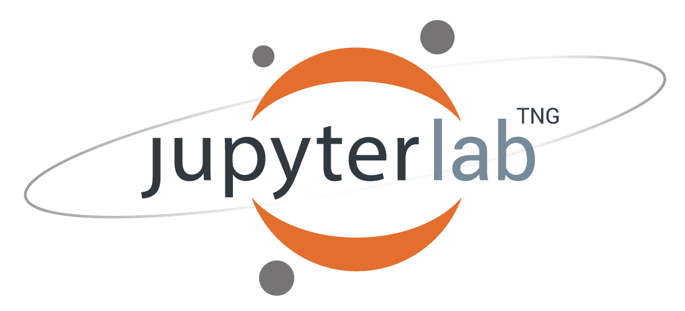

# Data Clinic Technical Fit Assessment

Public repository that exposes project partners and collaborators to open source tooling, python libraries, and simple programs requiring command line execution.


## How do we assess fit?

Working through the steps laid out in this README helps us jumpstart a conversation around your comfort using open source tools and technologies that the Data Clinic could use during the partnership. For example, docker, python-based modules, jupyter notebook, and command line execution. 


When our partners don't have a prescribed ecosystem (i.e. tech stack) it's important that we design a solution that you can truly own after handover. Early exposure to the design components that support our analytics and applications helps project partners know what they'll be using to do their work.

Early shared understanding of what we need to do (re: design) and what y'all need to do (re: upskilling) gives us all much more room to maneauver. For example, we can make different design choices from the get-go, spend some time through-out the project upskilling, or guide you towards free or low-cost learning materials. Or perhaps this experience stimulates conversations within your team on different platforms to explore going forward (Tableau? Google Cloud? Azure?).

### What must you do?

To complete the exercise, follow the steps below. We recommend that you actively document your process and as you go along.

Some thoughts to keep in mind as you journal:

- Where did you get stuck? How did you unstick yourself? Did you use any online guides/materials to help you out?

- What did you learn? Was anything you were asked to do that surprised you?

- Think about your current processes - imagine where this new tool will fold into that process. Describe that too.


# Steps

## 1. Do Your Downloads!

### Get your code editor ready


We recommend that you adopt a code editor to avoid working solely in terminal. For the sake of this exercise, download the free version of [Visual Studio Code](https://code.visualstudio.com/). Note that there are other open source, free editors out there to chose from!

### You're going to work with Github

Git is a distributed version control system. Every change made to code is tracked in the repository. Also, the entire codebase and history is available on every developer/user's computer, which allows for easy branching and merging and executing. [More info on Github](https://www.simplilearn.com/tutorials/git-tutorial/what-is-github)

Must Dos
1. [Create a Github account](https://docs.github.com/en/get-started/signing-up-for-github/signing-up-for-a-new-github-account)
2. [Configure Github for your local environment](https://docs.github.com/en/get-started/quickstart/set-up-git)
3. [Clone the existing repository](https://git-scm.com/book/en/v2/Git-Basics-Getting-a-Git-Repository)

Extra Credit
1. [Fork a repo](https://docs.github.com/en/get-started/quickstart/fork-a-repo)

### Get your Docker daemon ready


We aren't going to ask you to set-up a python-friendly development environment on your local machine. Instead, we'll guide you through a containerized solution.
 
"Docker is a tool for creating and deploying isolated environments for running applications with their dependencies. Basically, Docker makes it easy to write and run codes smoothly on other machines with different operating systems by putting together the code and all its dependencies in a container. This container makes the code self-contained and independent from the operating system." [Source Article](https://medium.com/analytics-vidhya/docker-for-data-science-442299c5203c)

1. [Download Docker Destop](https://www.docker.com/products/docker-desktop/)

## 2. Interact with tools and libraries via command line execution

### Build and run the docker container

Open Visual Studio Code and clone this repository.

```
docker build -t data-clinic-technical-assessment .
```
```
docker run -it -p 8000:80 -p 8888:8888 -v $(pwd):/technical_test data-clinic-technical-assessment bash
```

### Generate data files via command line

```
make run_data
```
This will write a file called `test.csv` to `./data/interim` directory.

```
python -m src.data.make_census_data --group_id S1501 --geometry_level NECTA
```
This will call the census api and populate write the following files to your local `./data` directory.

```
./raw/NECTA
        └── tiger_zip.zip

./interim/NECTA
            ├── tl_2020_us_necta.cpg
            ├── tl_2020_us_necta.dbf
            ├── tl_2020_us_necta.prj
            ├── tl_2020_us_necta.shp
            ├── tl_2020_us_necta.shp.ea.iso.xml
            ├── tl_2020_us_necta.shp.iso.xml
            └── tl_2020_us_necta.shx

./processed/NECTA
              └── census_geom_NECTA.geojson
```

If you see these files, then it worked!

Feel free to explore census data by trying different table/geography combinations.
[List of ACS 2020 5-year subject tables](https://www.census.gov/acs/www/data/data-tables-and-tools/subject-tables/)

### Modify the config.py file

Open the config.py file located under the `./src` directory. Modify the string variable specified after `WORD_FOR_PRINT =` and save the file. Run the command `make run_data` again and see if the printed statement changes.

### Create Geospatial Visualizations in Jupyter Notebooks




Once you've launched your local container and you're in the bash terminal, execute:

```
jupyter lab --ip 0.0.0.0 --allow-root --NotebookApp.notebook_dir=/technical_test
```

Copy and paste the https path from the terminal into your web browser. I am confident that this works for Chrome. This link will take you to a Jupyter Lab environment whose kernel is backed by your local docker container. Note that closing the terminal will end your Jupyter Lab session

There is an example notebook in the `./notebooks directory` called `data_visualization`.

Practice running the notebook cells. And feel free to play around with them! This is a space designed for you to explore.

To end your jupyter session, run `ctrl+c` in terminal.

### References [for Jen as she develops...]

- https://pythonspeed.com/articles/activate-conda-dockerfile/
- https://www.linuxteacher.com/docker-add-vs-copy-vs-volume/#:~:text=VOLUME%20is%20different%20from%20COPY,operating%20system%20can%20interact%20with.&text=This%20command%20syncs%20the%20Docker,host%20OS's%20cool%2Dproject%20directory.
- https://www.youtube.com/watch?v=EpuNiXfk-u0
